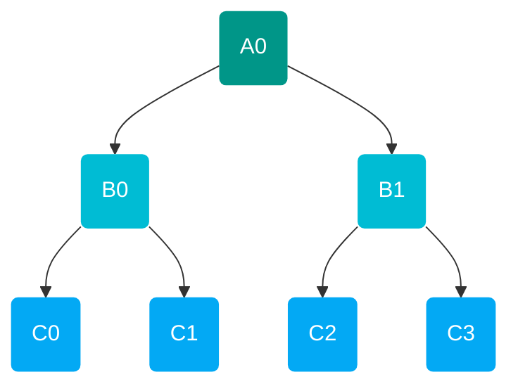

Compilers are composed of passes, each of which performs a specific operation on the abstract syntax tree (AST). A [`Pass`](#pass) makes use of the visitor pattern to traverse and manipulate an abstract syntax tree (AST). In our infrastructure, we separated the logic ([`Rule`](#rule)) and traversal ([`Walk`](#walk)) of the visitor pattern for better modularity. Passes can be composed, such as with a [`Rewriter`](#rewriter), to form more complex passes.

## Rule 
 [][oqd_compiler_infrastructure.rule] 

Rules are used in compilers to specify a scheme for matching and manipulating nodes in an AST. The nodes may be manipulated in several ways:

- Unchanged
- Mapped to a node of the current AST (Rewrite)
- Mapped to a node of a different AST (Conversion)

/// tab | Rewrite Rule

The rewrite rule is the most basic rule that either leaves the AST unchanged or converts AST nodes between compatible nodes of the AST.

/// html | div[style='float: right']
[][oqd_compiler_infrastructure.rule.RewriteRule]
///
///
/// tab | Conversion Rule

The conversion rule handles the specific case where the AST nodes need to be transformed to nodes of a different AST.

<!-- prettier-ignore -->
//// admonition | Note
    type: note

Conversion requires that the AST is traversed in a topological order (children nodes converted before parent nodes) limiting the possible walks to only the [`Post`](#__tabbed_2_2) walk.
////

/// html | div[style='float: right']
[][oqd_compiler_infrastructure.rule.ConversionRule]
///
///

## Walk 
 [][oqd_compiler_infrastructure.walk] 

Walks are the different algorithms for traversing the AST, demonstrated with the following tree:

/// tab | Pre

//// tab | Regular
$$ A0\rightarrow B0 \rightarrow C0 \rightarrow C1 \rightarrow B1 \rightarrow C2 \rightarrow C3 $$
////
//// tab | Reverse

<!-- prettier-ignore -->
///// admonition | Note
    type: note

The reverse flag triggers right to left traversal in the walk instead of the regular left to right.
/////

$$ A0\rightarrow B1 \rightarrow C3 \rightarrow C2 \rightarrow B0 \rightarrow C1 \rightarrow C0 $$
////

//// html | div[style='float: right']
[][oqd_compiler_infrastructure.walk.Pre]
////
///

/// tab | Post
//// tab | Regular
$$ C0\rightarrow C1 \rightarrow B0 \rightarrow C2 \rightarrow C3 \rightarrow B1 \rightarrow A0 $$
////
//// tab | Reverse

<!-- prettier-ignore -->
///// admonition | Note
    type: note

The reverse flag triggers right to left traversal in the walk instead of the regular left to right.
/////

$$ C3\rightarrow C2 \rightarrow B1 \rightarrow C1 \rightarrow C0 \rightarrow B0 \rightarrow A0 $$
////

//// html | div[style='float: right']
[][oqd_compiler_infrastructure.walk.Post]
////

///

/// tab | In
//// tab | Regular
$$ C0\rightarrow B0 \rightarrow C1 \rightarrow A0 \rightarrow C2 \rightarrow B1 \rightarrow C3 $$
////

//// tab | Reverse

<!-- prettier-ignore -->
///// admonition | Note
    type: note

The reverse flag triggers right to left traversal in the walk instead of the regular left to right.
/////
$$ C3\rightarrow B1 \rightarrow C2 \rightarrow A0 \rightarrow C1 \rightarrow B0 \rightarrow C0 $$
////

<!-- prettier-ignore -->
//// admonition | Note
    type: note

Due to the traversal order in the In walk, this walk is only compatible with rules that leave the AST unchanged (e.g. analysis and verification)
////

//// html | div[style='float: right']
[][oqd_compiler_infrastructure.walk.In]
////

///

/// tab | Level
//// tab | Regular
$$ A0\rightarrow B0 \rightarrow B1 \rightarrow C0 \rightarrow C1 \rightarrow C2 \rightarrow C3 $$
////
//// tab | Reverse

<!-- prettier-ignore -->
///// admonition | Note
    type: note

The reverse flag triggers right to left traversal in the walk instead of the regular left to right.
/////

$$ A0\rightarrow B1 \rightarrow B0 \rightarrow C3 \rightarrow C2 \rightarrow C1 \rightarrow C0 $$
////

<!-- prettier-ignore -->
//// admonition | Note
    type: note

Due to the traversal order in the Level walk, this walk is only compatible with rules that leave the AST unchanged (e.g. analysis and verification)
////

//// html | div[style='float: right']
[][oqd_compiler_infrastructure.walk.Level]
////

///

## Pass

A pass is an operation that processes the entire AST. Passes perform several purposes:

/// tab | Canonicalization
The canonicalization pass puts the AST into a canonical form eliminating redundancy in the AST.
///
/// tab | Analysis
The analysis pass extracts information from the AST.
///
/// tab | Verification
The verification pass checks the validity of the AST.
///
/// tab | Optimization
The optimization pass improves the performance of the program represented by the AST.
///
/// tab | Conversion
The lowering pass converts the AST to a different AST.
///
/// tab | Execution
The execution pass implements and executes the instructions of the AST to produce results (i.e. defines an interpreter for the AST).
///

The simplest form for a pass is just a [`rule`](#rule) and [`walk`](#walk) pair. These simple passes can be combined to form a more complicated pass (e.g. with a [`rewriter`](#rewriter)).

## Rewriter 
 [][oqd_compiler_infrastructure.rewriter] 

A rewriter implements logic for composing and transforming passes.

/// tab | Chain

The chain rewriter sequentially applies passes to form complex passs.

/// html | div[style='float: right;']
[][oqd_compiler_infrastructure.rewriter.Chain]
///
///
/// tab | Fixed Point

The fixed point rewriter transforms a pass by iteratively applying the pass till convergence of the AST.

/// html | div[style='float: right;']
[][oqd_compiler_infrastructure.rewriter.FixedPoint]
///
///
