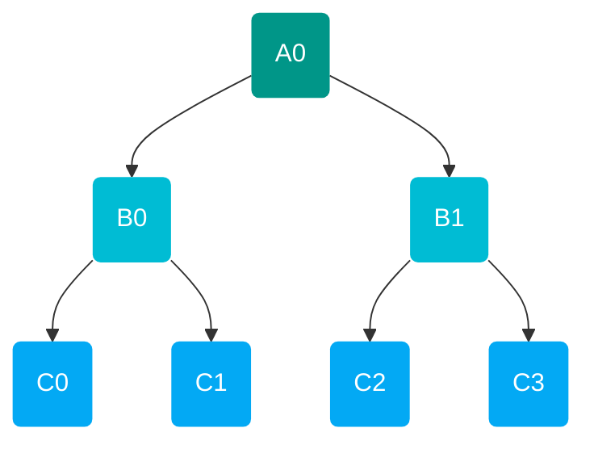

Compilers are composed of passes, each of which performs a specific operation on the abstract syntax tree (AST). A [`Pass`](#pass) makes use of the visitor pattern to traverse and manipulate an abstract syntax tree (AST). In our infrastructure, we separated the logic ([`Rule`](#rule)) and traversal ([`Walk`](#walk)) of the visitor pattern for better modularity. Passes can be composed, such as with a [`Rewriter`](#rewriter), to form more complex passes.

## Rule 
 [][oqd_compiler_infrastructure.rule] 

Rules are used in compilers to specify a scheme for matching and manipulating nodes in an AST. The nodes may be manipulated in several ways:

- Unchanged
- Mapped to a node of the current AST (Rewrite)
- Mapped to a node of a different AST (Conversion)

## Walk 
 [][oqd_compiler_infrastructure.walk] 

Walks are the different algorithms for traversing the AST, demonstrated with the following tree:

/// tab | Pre
//// tab | Regular
$$ A0\rightarrow B0 \rightarrow C0 \rightarrow C1 \rightarrow B1 \rightarrow C2 \rightarrow C3 $$
///// html | div[style="float: right;"]
[][oqd_compiler_infrastructure.walk.Pre]
/////

////
//// tab | Reverse
$$ A0\rightarrow B1 \rightarrow C3 \rightarrow C2 \rightarrow B0 \rightarrow C1 \rightarrow C0 $$
///// html | div[style='float: right']
[][oqd_compiler_infrastructure.walk.Pre]
/////
////
///

/// tab | Post
//// tab | Regular
$$ C0\rightarrow C1 \rightarrow B0 \rightarrow C2 \rightarrow C3 \rightarrow B1 \rightarrow A0 $$
///// html | div[style='float: right']
[][oqd_compiler_infrastructure.walk.Post]
/////
////
//// tab | Reverse
$$ C3\rightarrow C2 \rightarrow B1 \rightarrow C1 \rightarrow C0 \rightarrow B0 \rightarrow A0 $$
///// html | div[style='float: right']
[][oqd_compiler_infrastructure.walk.Post]
/////
////
///

/// tab | In
//// tab | Regular
$$ C0\rightarrow B0 \rightarrow C1 \rightarrow A0 \rightarrow C2 \rightarrow B1 \rightarrow C3 $$
///// html | div[style='float: right']
[][oqd_compiler_infrastructure.walk.In]
/////
////
//// tab | Reverse
$$ C3\rightarrow B1 \rightarrow C2 \rightarrow A0 \rightarrow C1 \rightarrow B0 \rightarrow C0 $$
///// html | div[style='float: right']
[][oqd_compiler_infrastructure.walk.In]
/////
////
///

/// tab | Level
//// tab | Regular
$$ A0\rightarrow B0 \rightarrow B1 \rightarrow C0 \rightarrow C1 \rightarrow C2 \rightarrow C3 $$
///// html | div[style='float: right']
[][oqd_compiler_infrastructure.walk.Level]
/////
////
//// tab | Reverse
$$ A0\rightarrow B1 \rightarrow B0 \rightarrow C3 \rightarrow C2 \rightarrow C1 \rightarrow C0 $$
///// html | div[style='float: right']
[][oqd_compiler_infrastructure.walk.Level]
/////
////
///

## Pass

## Rewriter 
 [][oqd_compiler_infrastructure.rewriter] 

